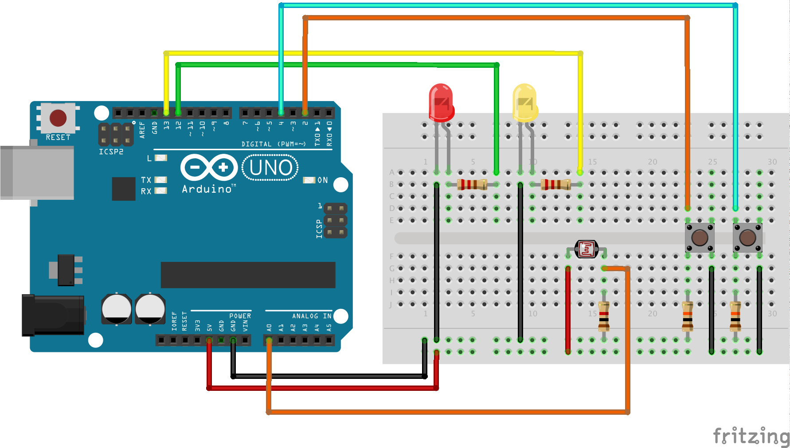

**thing-it-node** allows you to 
* connect controllers like Arduino Uno to your computer (e.g. a Raspberry Pi) to centralize Internet access to a scalable set of Sensors and Actors,
* invoke REST services on all Actors,
* receive WebSocket notifications on all Sensor data changes and events,
* define higher-level services on multiple Actors and also invoke those via REST and
* define Complex Event Processing on Sensor data changes and events. 

All of the above is controlled by a **[nodejs](http://nodejs.org/)** server which is bootstrapped from a simple JSON configuration.

# Philosophy

**thing-it-node** is created because we felt the need for a scalable management entity which bridges Internet services and multiple, possibly heterogenous devices. It is not intended to compete with, but rather complement and use great libraries and frameworks like

* **[Fritzing](http://fritzing.org/)** by FH Potsdam,
* **[Johnny Five](https://github.com/rwaldron/johnny-five/wiki/Board)** by Rick Waldron or
* aREST by Marco Schwarz

# Getting Started

Let's try to set up a simple - but not too simple - home automation scenario:

1. Two LEDs representing e.g. two lamps.
1. An LDR to detect the light in a room and event processing to switch both lamps if the light goes below some threshold.
1. Two buttons to toggle the state of each lamps.
1. A simple (mobile capable) web application to toggle the state of both lamps individually and together and to display the event under 2.

To setup this scenario you need the following hardware

* an Arduino Uno board [http://www.adafruit.com/product/50](http://www.adafruit.com/product/50),
* two LEDs e.g. [https://www.sparkfun.com/products/9590](https://www.sparkfun.com/products/9590),
* a Photocell, e.g. [http://www.adafruit.com/product/161](http://www.adafruit.com/product/161),
* two buttons, e.g.
* possibly a breadboard (e.g. [http://www.adafruit.com/product/64](http://www.adafruit.com/product/64)) and 
* some jumper wires [http://www.adafruit.com/product/758](http://www.adafruit.com/product/758)

all of the above is also available with Arduino Starter Kits like

* or
*

To configure and run *thing-it-node*, install *nodejs* and *npm* on your computer Raspberry Pi. 

Then install **thing-it-node**:

`npm install thing-it-node`

in a directory _installDir_.

For our example above modify the file _installDir_/**configuration.js** as follows

`nodeConfigurationFile : "_installDir_/examples/simple-lighting/configuration.json"`

If you are interested, have a look at the [configuration file](./thing-it-node/examples/simple-lighting/configuration.json).

Start the thing-it-node from _installDir_ via

`node thing-it-node.js`

You will see something like

    ---------------------------------------------------------------------------
     thing-it Node at http://0.0.0.0:3001

     Copyright (c) 2014-2015 Marc Gille. All rights reserved.
    -----------------------------------------------------------------------------

    Loading plugin <arduino>.
    Starting Node <Home>.
     	Starting Controller <Arduino Uno 1>
		Actor <LED1> started.
    Published message Cannot initialize arduino1/led1:TypeError: Cannot read property 'type' of null
		Actor <LED2> started.
    Published message Cannot initialize arduino1/led1:TypeError: Cannot read property 'type' of null
		Sensor <Button> started.
    Published message Cannot initialize arduino1/button1:TypeError: Cannot read property 'type' of null
		Sensor <Button> started.
    Published message Cannot initialize arduino1/button1:TypeError: Cannot read property 'type' of null
	Controller <Arduino Uno 1> started.

which means that your **thing-it-node** server has started properly, found its configuration but determined that your Arduino Board is not wired up yet. Hence,

* connect your Arduino Board via USB,
* connect the LEDs to Pin 12 and 13.
* connect the Buttons to Pin 2 and 4.
* connect the Photocell to Pin A0.

e.g. like

Restart the **thing-it-node** server. The server output should now look like 

You should also be able switch both LEDs on and off via the respective buttons or switch both LEDs on by covering the Photocell.

Finally, connect your browser to 

`http://localhost:3001/examples/simple-lighting/console.html`

Browser content should look like

If you have remote (e.g. Wifi) access to the computer running the **thing-it Server**, you may also use a mobile device (e.g. an iPhone or iPad) to connect to your simple lighting system.

Let us recap what we did:

With

* a simple confirguration file,
* the corresponding wiring of the Arduino and 
* a very simple HTML file

but **no programming** we were able to create a simple but realistic home automation scenario.

# Taking it further

If you have the **Getting Started** example running, you may want to

* understand the concepts of *thing-it* better
* have a look at further examples
